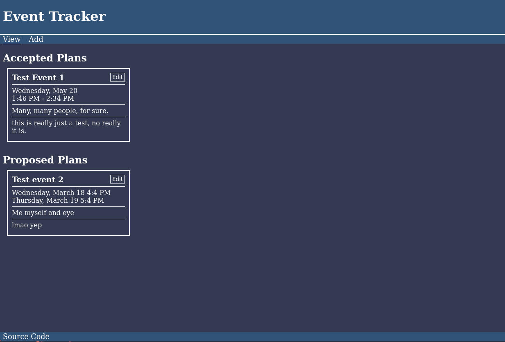
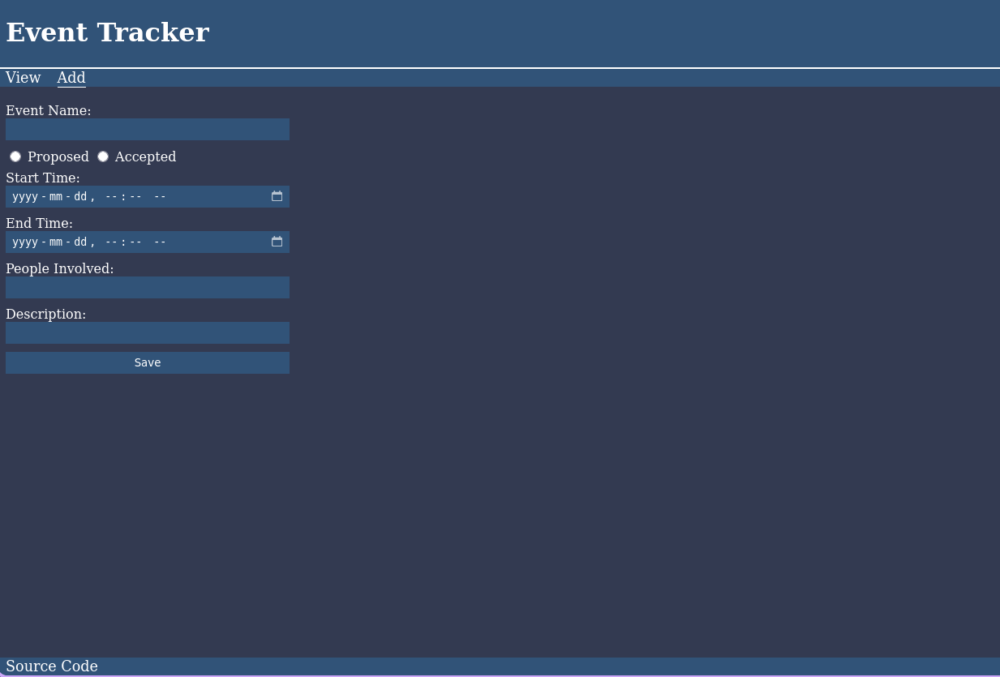
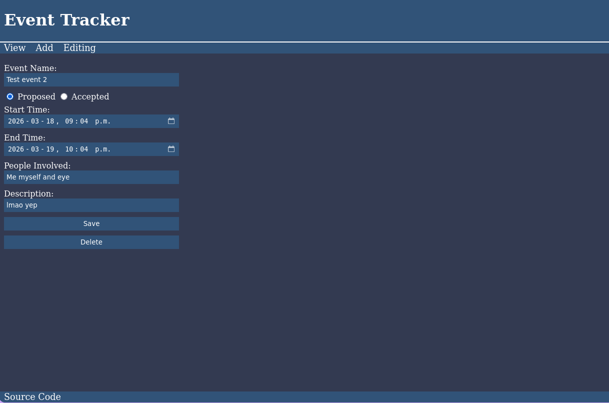

## Dependencies
- node.js
- npm
- postgresql

## How to install
Install postgres, create a user for the program to use, and create a data base with 2 tables for it to use:
```sql
CREATE TABLE sections (
	id serial PRIMARY KEY,
	name VARCHAR (100),
);
```
```sql
CREATE TABLE events (
	id serial PRIMARY KEY
	name VARCHAR (100),
	sectionId integer references sections(id),
	starttime timestamp,
	endtime timestamp,
	people text,
	description text
);
```
```sh
cd /opt
git clone https://github.com/Soulful-Sailer/Event-Tracker/
cd Event-Tracker
npm install
cp event-tracker.service /etc/systemd/system/.
cp config-template.json config.json
```
Edit config.json and add your database details.
Then start the server with `systemctl start event-tracker.service`

## Screenshots
### Main Page

### Add Event Page

### Edit Event Page

